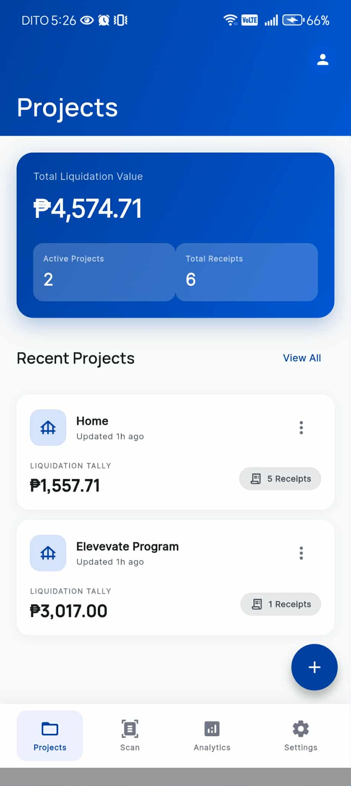
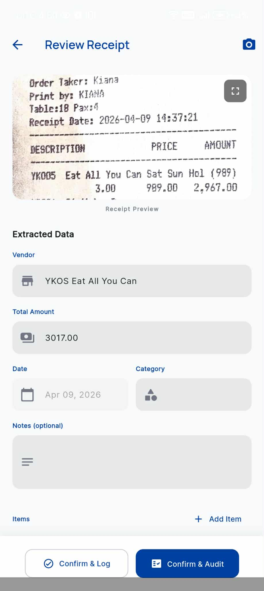
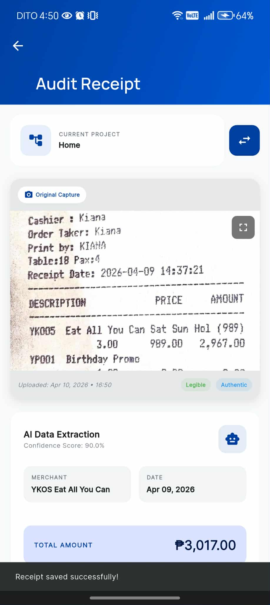
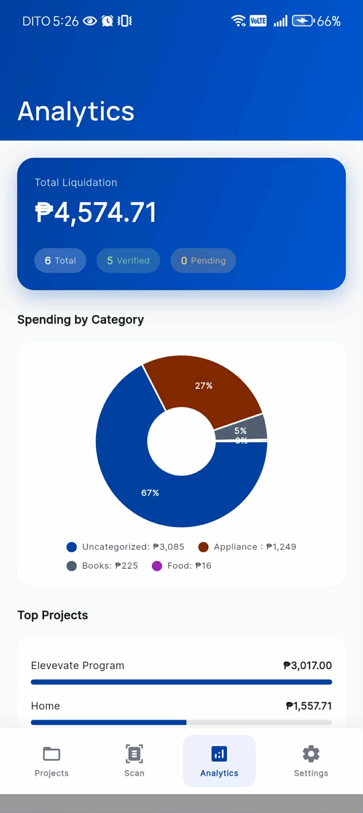
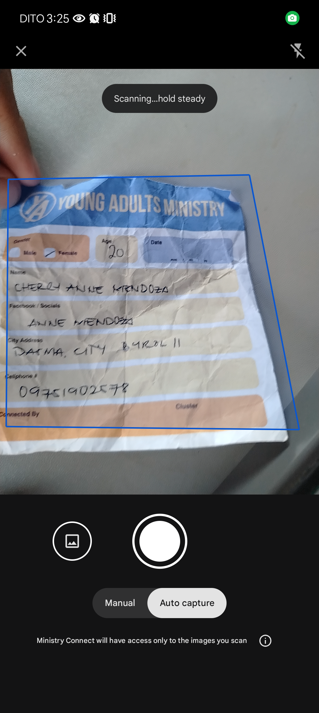

# Liquify - Liquidation Receipt Scanner

<p align="center">
  
</p>

<p align="center">
  <strong>Liquify</strong> - Liquidation Receipt Scanner<br />
  Scan, summarize, and audit receipts on-the-go.
</p>

---

## Overview

Liquify is a Flutter mobile application designed to streamline the management of liquidation receipts. It provides powerful features for scanning, extracting data from, and auditing receipts in the field. Whether you're managing construction projects, event budgets, or organizational expenses, Liquify helps you digitize and organize your receipt collection with ease.

## Features

### Receipt Scanning & OCR
- **Document Scanning**: Auto edge detection and perspective correction using intelligent document scanning
- **Camera Capture**: Take photos directly or import from gallery
- **OCR Text Recognition**: Extract text using Google ML Kit
- **AI-Powered Extraction**: Intelligent data extraction using AI models (Groq Cloud, Gemini)

### Project Management
- **Project-Based Organization**: Create and manage multiple projects
- **Project Phases**: Track different phases (Phase 1, Phase 2, etc.)
- **Location Tracking**: Store project locations
- **Budget Tracking**: Monitor spending against project budgets

### Audit & Verification
- **Receipt Verification**: Verify and approve individual receipts
- **Audit Workflow**: Review pending receipts with detailed inspection
- **Status Tracking**: Track verification status (Pending, Verified, Rejected)
- **Notes & Comments**: Add audit notes and rejection reasons
- **Pending Audits Dashboard**: View all pending audits at a glance

### Analytics Dashboard
- **Total Liquidation Overview**: View total spending across all projects
- **Category Breakdown**: Pie charts showing spending by category
- **Project Spending**: Bar charts comparing project expenditures
- **Monthly Trends**: Track spending patterns over time
- **Receipt Statistics**: Verified vs. pending counts

### Data Management
- **Local SQLite Database**: Offline-first storage using Drift (SQLite)
- **Supabase Backend**: Cloud sync and backup capabilities
- **PDF Export**: Generate and export receipt reports as PDF
- **Data Export**: Export data for external processing

### User Experience
- **Push Notifications**: Stay updated with important alerts
- **Dark/Light Theme**: System-based theme switching
- **Material Design 3**: Modern, clean UI following Material Design guidelines
- **Intuitive Navigation**: Bottom navigation with tab-based routing

### Additional Features
- **Search**: Find receipts quickly
- **Filtering**: Filter by status, date, project
- **Image Gallery**: View receipt images in a gallery layout
- **Storage Management**: View and manage local storage usage

---

## Tech Stack

| Category | Technology |
|----------|------------|
| **Framework** | Flutter 3.9+ |
| **Language** | Dart |
| **State Management** | Riverpod (flutter_riverpod) |
| **Navigation** | GoRouter |
| **Local Database** | Drift (SQLite) |
| **Backend** | Supabase |
| **OCR** | Google ML Kit Text Recognition |
| **AI/ML** | Flutter Gemma, Groq Cloud API |
| **Document Scanning** | Cunning Document Scanner |
| **Charts** | FL Chart |
| **PDF Generation** | pdf + printing |
| **Image Processing** | image package |
| **Notifications** | flutter_local_notifications |
| **UI** | Material Design 3, Google Fonts |

---

## Architecture

The app follows a clean architecture pattern:

```
lib/
├── core/
│   ├── router/          # Navigation configuration
��   └── theme/          # Theme, colors, typography
├── data/
│   ├── database/      # Drift database schema
│   └── services/       # Business logic services
├── presentation/
│   ├── providers/     # Riverpod providers
│   ├── screens/       # UI screens
│   └── widgets/       # Reusable widgets
└── main.dart          # App entry point
```

---

## Screens

### Key Screens

1. **Login Screen** - User authentication and account creation
2. **Projects List** - Browse and manage all projects
3. **Project Detail** - View project details and receipts
4. **Scanner/Camera** - Scan or capture receipt images
5. **Receipt Review** - Review and edit scanned receipt data
6. **Receipt Gallery** - View all receipt images in a project
7. **Audit Verification** - Verify and approve receipts
8. **Pending Audits** - View all receipts pending verification
9. **Analytics Dashboard** - View spending analytics and charts
10. **Settings** - App preferences and about information

---

## Screenshots

> **Note**: Screenshots are captured from a physical Android device. Due to authentication requirements, some inner screens require login to access. The app features a modern Material Design 3 interface with gradient headers and intuitive navigation.

<p align="center">
  <strong>Main Dashboard</strong><br />
  
</p>

<p align="center">
  <strong>Receipt Review</strong><br />
  
</p>

<p align="center">
  <strong>Audit Verification</strong><br />
  
</p>

<p align="center">
  <strong>Analytics Dashboard</strong><br />
  
</p>

<p align="center">
  <strong>Login Screen</strong><br />
  
</p>

<p align="center">
  <strong>Projects List</strong><br />
  
</p>

<p align="center">
  <strong>Scanner</strong><br />
  
</p>

<p align="center">
  <strong>Receipt Gallery</strong><br />
  
</p>

<p align="center">
  <strong>Audit Verification</strong><br />
  
</p>

<p align="center">
  <strong>Analytics</strong><br />
  
</p>

<p align="center">
  <strong>Settings</strong><br />
  
</p>

---

## Installation

### Prerequisites

- Flutter SDK 3.9+
- Dart SDK 3.9+
- Android SDK (for Android builds)
- Xcode (for iOS builds, optional)

### Step 1: Clone the Repository

```bash
git clone https://github.com/your-repo/liquification-scanner.git
cd liquification-scanner
```

### Step 2: Install Dependencies

```bash
flutter pub get
```

### Step 3: Configure Environment Variables

Create a `.env` file in the project root with the following variables:

```env
# Supabase Configuration
SUPABASE_URL=your_supabase_url
SUPABASE_ANON_KEY=your_supabase_anon_key

# Groq Cloud API (for AI extraction)
GROQ_API_KEY=your_groq_api_key

# Google Gemini API (for AI extraction)
GEMINI_API_KEY=your_gemini_api_key
```

### Step 4: Build the App

#### Android (Debug)

```bash
flutter build apk --debug
```

#### Android (Release)

```bash
flutter build apk --release
```

#### iOS (Debug)

```bash
flutter build ios --debug
```

### Step 5: Run the App

```bash
flutter run
```

---

## Building for Release

### Android Release Build

1. Configure signing in `android/app/build.gradle`:
   ```groovy
   signingConfigs {
       release {
           storeFile file("your-key-store.jks")
           storePassword "your-store-password"
           keyAlias "your-key-alias"
           keyPassword "your-key-password"
       }
   }
   ```

2. Build the release APK:
   ```bash
   flutter build apk --release
   ```

3. The APK will be generated at `build/app/outputs/flutter-apk/app-release.apk`

---

## Database Schema

The app uses Drift (SQLite) for local storage. Key tables include:

- **projects**: Project information (name, description, location, phase, budget)
- **receipts**: Receipt data (vendor, amount, date, category, status, image path)
- **audit_logs**: Audit history and notes

---

## API Integration

### Supabase
- User authentication
- Cloud data backup
- Feedback submission

### Google ML Kit
- Text recognition (OCR)

### Groq Cloud / Gemini
- AI-powered receipt data extraction
- Intelligent categorization

---

## Privacy

- All data is stored locally on your device by default
- Optional cloud sync with Supabase
- No third-party data sharing without consent
- Images stored in app-private storage

---

## Contributing

Contributions are welcome! Please feel free to submit a Pull Request.

---

## License

This project is licensed under the MIT License.

---

## Contact

- **Email**: rajienomoto@gmail.com
- **GitHub**: [Your GitHub Repository]

---

<p align="center">
  <sub>Liquify - Streamline Your Receipt Management</sub>
</p>